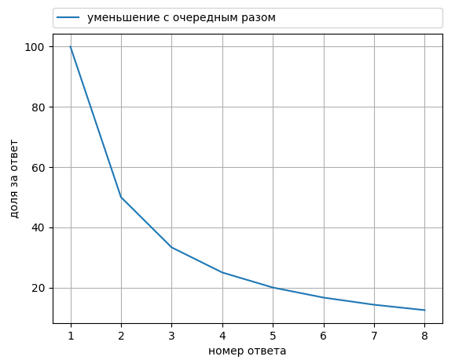

#####################################
Интерфейс преподавателя IU7QuizBot
#####################################

***************
Назначение
***************

Предоставленное программное обеспечение (далее ПО) предназначено выполнять следующие задачи:

* Анализ текущих знаний студентов
* Выявление проблемных или сложных тем курса
* Удобная коммуникация между студентами и лектором курса

********************************************
Внесение вопросов в базу данных
********************************************

Тут должно быть что-то...

*******************************
Рейтинговая система, вступление
*******************************

Время, спустя которое начинается ответ на вопрос
================================================

Данная характеристика с первого взгляда может показаться, исходя из следующих рассуждений: *"А что если человек просто не мог ответить боту, потому что спал/был_на_тренировке/бегал/ел (и прочее)?"*. Но на это есть и другие предположения: *"Что если человек специально не отвечает, выжидая ответа других, дабы на 100% ответить правильно и быстро?"*. Следовательно, может по-разному складываться ситуация, однако учитывая оба пункта, было решено сделать следующим образом: ``время, отсчитываемое от отправки вопроса до начала ответа на него будет измеряться в часах и иметь наименьший вес среди всех критериев оценки (обсуждение конкретных цифр - в другом разделе)``

2. Время ответа на вопрос
=========================

Вторая по весу характеристика и вторая характеристика, оценивающая ценность текущего ответа (потому что следующие 2 хар-ки складываются исходя из правильности предыдущих ответов и кол-ва правильных ответов). Данная характеристика будет высчитываться в секундах, ориентир для конкретной задачи (то есть среднее время ответа или хорошее время ответа) будет задавать лектор, так как на различные задачи требуется различное время (см. другой раздел для подробного описания)

3. Сложность задачи
===================

Немаловажным является так же сложность задачи. Если с задачей справляется только 20%, то эта задача определенно требовала каких-то больших знаний или большей внимательности. Если же на задачу отвечают все поголовно, то и ценность ее ниже.

4. Количество неправильных ответов на вопрос
============================================

*7 раз отмерь - один раз отрежь.*

Данная характеристика является 3 по весу (чем больше, тем лучше), для избежания ситуации, когда студент пытается неглядя выбить себе лучшее время, давая ответ на вопрос наугад. Если данная характеристика будет весомой, то это заставит учеников вдумываться и несколько раз проверять себя, прежде, чем дать ответ (однако ее значимость будет сравнима со значимостью 2 характеристики)

5. Номер раза, в который задается вопрос
========================================

Очевидно, что при 2 попытке ответить на вопрос, на который ты уже давал правильный ответ, сложно ошибиться и сложно потратить на это времени больше, чем в 1 раз. Таким образом, действительно ценным становиться именно первый ответ на вопрос, а остальные ответы будут приносить уже меньше баллов (например: ``50%, 33%, ....``)

*******************************
Рейтинговая система в цифрах
*******************************

1. Формула для расчета баллов за правильный ответ
=================================================

`S = 100/n (0.35t1 + 0.65t2 - 0.2x) (1 - 0.2 (1 - d))`

**(приведено много чисел, чтобы было нагляднее, на деле числа могут быть другими)**

2. Значения и расчет единиц формулы:
====================================

1. t1 - коэффициент, зависящий от времени, через которое человек взялся за ответ на вопрос (пункт 1 первого раздела, измеряется в часах: равен 1, если ответ меньше часа и далее стремится к 0). **t1 = e^(-cn)**, где ``n`` - кол-во часов, прошедшее со времени выдачи вопроса (данная функция ассимптотически стремится к единице, и чем больше параметр с, тем больше потеря баллов в час (для примерной оценки параметра ``c``: ``c = ln2 / x`` - где х - кол-во часов, через которое потеряется половина баллов (то есть вместо t1 я подставил в формулу 0.5 и выразил c)))

Примерный вид функции (при указанных наверху условиях):

2. t2 - время ответа на вопрос (в секундах). Так, разница между ответами за 1 минуту и за 2 - гораздо больше, чем между ответами за 21 минуту и 22, таким образом это время тоже будет убывать нелинейно (наша задача сделать так, чтобы потеря первых секунд была более весомой, чем последующих). Таким образом функция следующая: **t2 = c / (n + c)** , где с - параметр, увеличение которого ведет к уменьшению скорости убывания баллов (видно, что 1 будет при ответе за 0 секунд (то есть хороших ответ будет только стремится к 1, но не будет ей равен), а далее значение зависит от параметра с). При этом, нужно как-то зафиксировать различную разбалловку за задачи, таким образом, для каждого вопроса имеет смысл хранить время, за которое можно получить 90% (то есть например для задачи ``сколько битов в байте`` это 2-3 секунды, а для задачи ``выберите соглашение о вызовах, подходящее под описание....``, порядка 6-9 секунд. Для с имеем: ``c = 9n`` (n - время в секундах))

Примерный вид функции (при указанных наверху условиях):

.. image:: _static/LC2.png

3. d - коэффициент сложности задачи (чем сложнее задача, тем круче ее решить). Расчет следующий: **d = a / b** (где а - кол-во людей, не справившихся с задачей, а b - общее кол-во людей, пытавшихся решить задачу (p.s.: для простоты: (1 - d) - коэффициент "легкости"); сложность будет максимальной, если ответит только один человек, но никогда не будет 1)

4. х - кол-во неправильных ответов ученика на данный вопрос (то есть от суммарного балла (исходящего от 2 времен, то есть еще не домноженного на коэффициент сложности) будет отниматься 20% (можно изменить) за каждую неправильную попытку на конкретный вопрос) 

5. n - раз, в который задается вопрос. Таким образом во 2 раз макс. оценка будет стремиться к 50, в 3 - к 33 и так далее.

Примерный вид функции:

************************************
Вопросы от студентов во время лекций
************************************

Здесь что-то будет...

