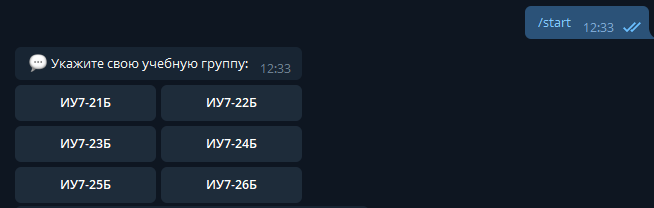

#####################################
Интерфейс преподавателя IU7QuizBot
#####################################

***************
Назначение
***************

Предоставленное программное обеспечение (далее ПО) предназначено выполнять следующие задачи:

* Анализ текущих знаний студентов
* Выявление проблемных или сложных тем курса
* Удобная коммуникация между студентами и лектором курса
********************************************
Внесение вопросов после лекций в базу данных
********************************************

*******************
Рейтинговая система
*******************

************************************
Вопросы от студентов во время лекций
************************************

Знать бы, как всё это работает...

