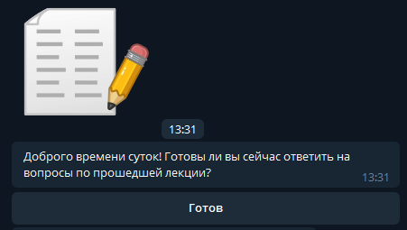
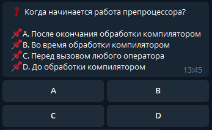
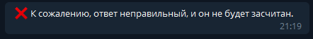
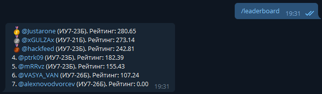

#####################################
Пользовательский интерфейс IU7QuizBot
#####################################

***************
Назначение
***************

Предоставленное программное обеспечение (далее ПО) предназначено выполнять следующие задачи:

* Анализ текущих знаний студентов
* Выявление проблемных или сложных тем курса
* Удобная коммуникация между студентами и лектором курса

***************
Применение
***************

Регистрация
===============

Перед тем, как начать работу с ботом, студенту следует зарегистрироваться в системе посредством задания боту @iu7quizbot в Telegram команды ``/start``

.. image:: _static/ST1.png

После этого следует выбрать свою группу, и увидеть заветное:

**Внимание:** ``не стоит пытаться зарегистрироваться в системе с нескольких аккаунтов, эти моменты отслеживаются, а при выявлении таких случаев возможно применение санкций в отношении виновного студента.``

Вопросы
===============

С некоторыми временными промежутками, зарегистрированным пользователям приходят следующий запрос:

**Стоит отметить, что, чем раньше пользователь нажмёт кнопку "Готов", тем больше баллов он получит.**

После нажатия на кнопку "Готов", студенту приходит вопрос в следующей форме:

Всё, что требуется от студента на данном этапе - выбрать правильный вариант ответа.

В случае, если Вы отвечаете правильно, Вы увидите следующее:

В обратном случае:

Таблица лидеров
===============

При задании команды ``/leaderboard`` боту, пользователь получит статистику ответов лучших студентов по следующему образцу:

***************************************
Возможные проблемы и способы их решения
***************************************

1. **Проблема:**

Я не могу зарегистрироваться в системе.

*Решение:*

Обратитесь с данной проблемой к лектору, возможно, Вы не внесены в систему.

2. **Проблема:**

Я ответил(-а) правильно, но бот не засчитал верный ответ.

*Решение:*

Если Вы уверены в своей правоте, обратитесь с данной проблемой к лектору, возможно, в системе выбран неверный правильный ответ на данный вопрос.

Также стоит отметить, что, если Вы каким-либо образом обманули систему *(это очень легко определяется)* , это чревато последствиями. **Не стоит так делать, проверяйте свои знания, это полезно :)**
